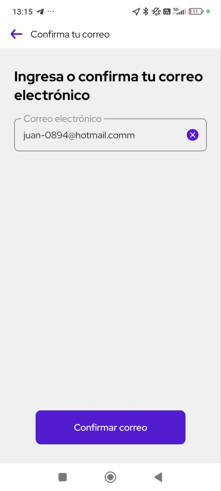
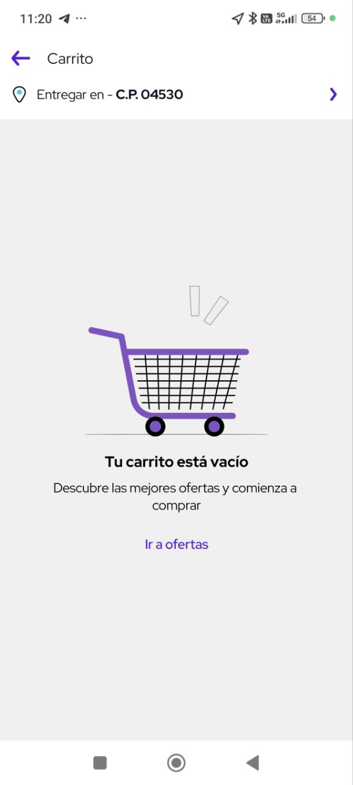
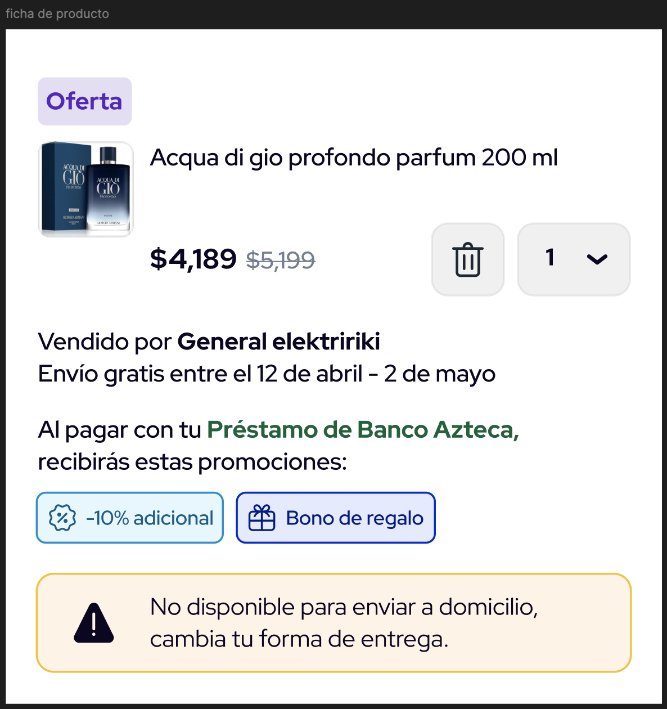
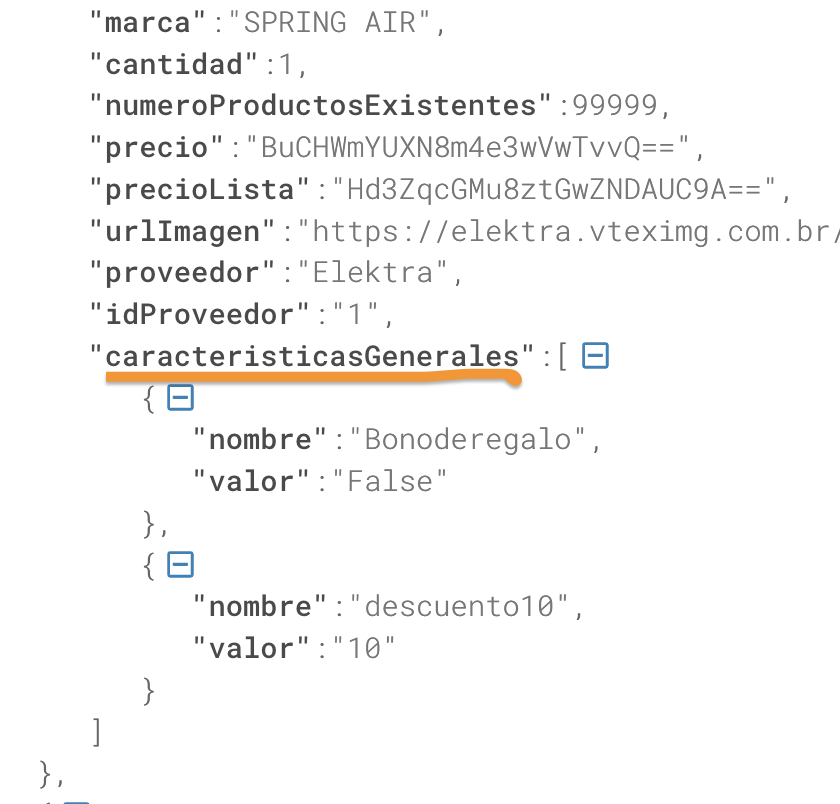
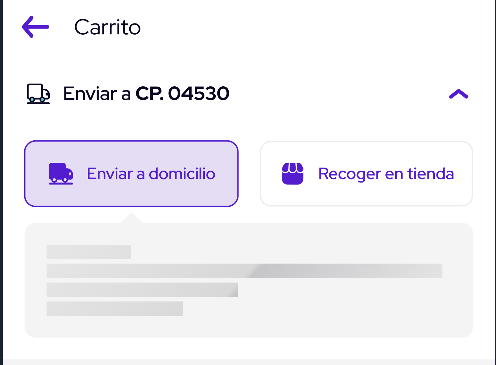

= Consumo de servicios del módulo de Carrito
Gibran Galicia Gómez, Francisco David Zárate Vásquez
v1.0, 2025-04-06
:description: Este documento se creó con la finalidad de mappear el consumo de los servicios en el flujo de Checkout (Resumen de carrito) y Checkout express así como reglas de negocio para cada sección de la vista \ \
Open Source.
:organization: Shopinbaz
:doctype: book
:preface-title: Preface
// Settings:
:experimental:
:reproducible:
:icons: font
:listing-caption: Listing
:sectnums:
:toc:
:toclevels: 3
:xrefstyle: short
ifdef::backend-pdf[]
:pdf-theme: chronicles
:pdf-themesdir: {docdir}
:title-logo-image: image:sample-banner.svg[pdfwidth=4.25in,align=center]
:source-highlighter: rouge
//:rouge-style: github
endif::[]

== Carrito

== Validaciones previas 
Para llegar al carrito debemos tener un id elektra.

=== Código postal predeterminado
Para poder obtener la información de los productos es necesario hacer una consulta con un código postal. El código postal se obtiene de la dirección predeterminada del usuario. en caso de que ele usuario no haya registrado direcciones antes, se ocupa el predefinido 04530.

=== ¿Cómo obtener el id Elektra?

El *id Elektra* está ligado al correo asociado a tu perfil. Cuando cambias de correo necesitas verificarlo para obtener uno nuevo.

La forma de llamar al flujo de validación del correo es por medio de un _start flow_ a través del GSSA/GSBD Interceptor. 


[cols="1,3", options = "header"]
|===
|Llave  | *GSIFPrf*
|Parámetros | subFlujo: mailVerificationFlow
|===

Ejemplo de llamado:

[source, texPlain]
----
GSINAdminNavigator.shared.startFlow(forAction: "GSIFPrf", navigateDelegate: self, withInfo: ["subFlujo": "mailVerificationFlow"])
----

.Confirmar tu correo


Una vez que se confirmó el correo se obtiene un *id Elektra*, sin embargo, a este le pueden hacer falta datos.

=== Tipos de ID Carrito
==== Persistente

- Se mantiene vivo durante todo el flujo de compra. Se guarda en GSPR/GSCH Commons.
- Existe hasta que se finaliza la compra, sea exitosa o no.
- Se elimina una vez que el flujo termina.
- De este id se obtiene el total de productos que se muestra en el widget del carrito de la app. 

==== Temporal

- Se utiliza únicamente en el flujo de compra rápida.
- No se guarda de manera persistente.

== ¿Cómo obtener el idCarrito?
El id carrito es un identificador en el que se liga toda la información de los productos. El PDP es el encargado de crear el idCarrito, por medio del boton *Comprar ahora* y *Agregar al carrito*. El equipo de navegación realiza un consumo al siguiente servicio:

.POST ShoppingCart

[source, https]
----
https://apigateway.superappbaz.com/integracion/superapp/compras/comercios/elektra-digital/carrito-compras/v1/productos
----

Para el request necesitamos el idCliente, tambien conocido como _idElektra_. Para el "idTipoCarrito" siempre se manda "2".

.Request: 
[,json]
----
{
   "transaccion":{
      "idCarrito":"",
      "idCliente":"06T1jZJnHGyRDf8KCnQAS+B7uTehWMhuGqS6oteuK2w",
      "idTipoCarrito":2,
      "productos":[
         {
            "cantidad":1,
            "proveedor":"1",
            "sku":8003913
         }
      ]
   }
}
----

Si el consumo fue exitoso, el servicio nos devuelve un idCarrito que es una cadena alfanumerica al cual se liga toda la información de los productos, así como información necesaria para la compra. 

.Response: 
[,json]
----
{
   "codigo":"200.Superapp-Compras-Comercios-Elektra-Digital-Catalogos.0000",
   "mensaje":"Operación Exitosa.",
   "folio":"6862c38e608d950f89cf0466be363d95-89cf0466be363d95",
   "resultado":{
      "idCarrito":"ab155c54b21d4d9ea3a33cccc3a64a2f",
      "totalProductos":1,
      "productos":[
         {
            "sku":"8003913",
            "idCategoria":"1371679",
            "idMarca":17,
            "facturable":false,
            "nombre":"Lavadora Automática Whirlpool 8MWTW2224MPM 22Kg Blanca",
            "referencia":0,
            "variante":"Lavadora Automática Whirlpool 8MWTW2224MPM 22Kg Blanca",
            "marca":"WHIRLPOOL",
            "cantidad":1,
            "numeroProductosExistentes":null,
            "precio":"9,999",
            "precioLista":"16,499",
            "urlImagen":"https://elektra.vteximg.com.br/arquivos/ids/12844726-80-80/8003913.jpg?v=638820564126330000",
            "proveedor":"Elektra",
            "idProveedor":"1",
            "caracteristicasGenerales":null
         }
      ],
      "informacionAdicional":[
         {
            "tipo":"noAddressInShoppingCart",
            "mensaje":"El carrito no tiene dirección de entrega",
            "estatus":"warning",
            "producto":{
               "sku":"",
               "referencia":"9999"
            }
         },
         {
            "tipo":"noClientProfileDataInShoppingCart",
            "mensaje":"El carrito no tiene datos de cliente",
            "estatus":"warning",
            "producto":{
               "sku":"",
               "referencia":"9998"
            }
         }
      ]
   },
   "advertencias":false
}
----

== Consumo de servicios del módulo de Carrito.

=== Validaciones del módulo.

Si ya existe el idElektra, del que hablamos antes, al entrar al módulo de carrito se valida que exista un _idCarrito_, sino existe se presenta el _empty state_ del carrito.

Sí el carrito es apto para envío a domicilio, es decir, todos los productos en el nodo de envíos disponibles tienen un idModeloLogistico igual a 1. En caso contrario de que alguna de estas condiciones no se cumplan, mostramos el _empty state_.

Posibles valores para idModeloLogistico:

- No se tiene seleccionada una dirección: 0
- Envío a domicilio: 1
- Recoger en tienda: 2
- Click & Collect: 3
- Envío digital (Gift Card): 4
- Producto Pendiente de Entrega (PPE): 5


.Empty state del carrito


En caso de que no todos los productos del carrito tenga entrega a domicilio, se muestra el siguiente escenario.

.Empty state del carrito


=== Get Carrito
Para obtener la información de los productos hacemos un consumo *GET* al siguiente servicio donde añadimos los siguientes parametros:

- ID Carrito
- Código postal predeterminado
- ID modelo logistico (1 por default)
- Consulta puntos en false  

[source, https]
----
https://apigateway.superappbaz.com/integracion/superapp/compras/comercios/elektra-digital/carrito-compras/v1/productos
----

== Mapear respuesta de GET CARRITO
Cuando el servicio GET CARRITO responde se muestra lo siguiente en pantalla:

=== Productos:
Del response de del servicio mencionado se obtiene el arreglo de productos, y por cada ítem de este arreglo se pinta una card de producto en un contenedor de lista,
Cada producto cuenta con una imagen del producto, un nombre, precio final, precio original, cantidad seleccionada, stock, nombre del vendedor,  precio de envío (en caso de estar seleccionado el tap de “Envío a domicilio), promesa de entrega, ademas de las promociones de ese producto si se decide comprarlo con la opción de “Préstamo”.

.Card de producto


==== Datos principales de productos
Los datos como imagen, nombre, precio final (precio en el json), precio original (precioLista en el json), cantidad, stock y nombre vendedor se obtienen del arreglo de productos en en response de GET CARRITO antes mencionado.Si el precio final es menor del precio original se muestra una etiqueta de “oferta” en la parte superior izquierda de la card de producto correspondiente.

[NOTE]
Dentro de este arreglo de producto en cada ítem viene un campo llamado referencia, que es el identificador del producto dentro del carrito. Este dato es importante porque se usa para lanzar los servicios para borrar el producto o actualizar su cantidad dentro del carrito.

==== Logística de entrega del producto
Para pintar la promesa de entrega del producto (únicamente a domicilio) se obtendrá del campo “fechaEntregaEstimada”  en los ítems del arreglo “logisticaEntregas” del response del GET CARRITO, estos ítems son  identificables por su “sku” con los ítems del arreglo de producto.

En caso de que el usuario tenga elegida la opción de recoger en tienda se debe pintar el texto “Recoge a partir de hoy” si su “idModeloLogistico” es “2”, si es “3”

Para pintar el precio de envío a domicilio se debe tomar igual del arreglo de”logisticaEntregas”, pero en este caso del arreglo de "enviosDisponibles", dentro de este  se busca el ítem que tenga el campo “idModeloLogistico” con el valor de “1” y se toma el campo “precio” para pintar como precio de envío. Si el precio es cero se pinta la leyenda “Envío gratis”.
Si el usuario tiene seleccionada la opción de recoger en tienda no se pinta el precio de envío.

==== Promociones en productos
Se obtionen de cada item de producto del response de GET CARRITO dentro del campo de “caracteristicasGenerales”.

.Nodo para promociones


Estas se pintan en forma de chips bajo la seccion de logistica de entrega de la card de producto.

Bono de regalo se pinta solo si su porpiedad "valor" es true.

Descuento adicional se pinta si existe un nodo en el cual el valor de su propiedad "nombre" empieza con "descuento" y se toma como el porsentaje del decuento la propiedad "valor". En la imagen anterior se ve un ejemplo de un descuento del 10%.

==== Alertas en productos

=== Montos

== Eventos de cards de productos
Cada card de producto tiene los evento de actualizar la cantidad del producto y borrarlo lamnzando sus servicios correspondientes que se detallaran más adelante.

Estos 2 ultimos servicios retornan el mismo responsable que GET CARRITO así que siguen el mismo proceso para pintar datos en pantalla.

=== Actualizar cantidad
Se realiza con el servicio PUT CANTIDADES de carrito 
"/superapp/compras/comercios/elektra-digital/carrito-compras/v1/productos/cantidades" 

Mandando en su request: el id del carrito, la referencia del producto, la nueva cantidad del producto y el codigo postal de la direccion actual del carrito.
```json
{
   "transaccion":{
      "puntosConsulta":false,
      "cantidad”:[NUEVA_CANTIDAD],
      ”codigoPostal”:”[CODIGO_POSTAL]”,
      ”idCarrito”:”[ID_CARRITO],
      ”idReferenciaProducto”:[REFERENCIA_PRODUCTO],
      ”idTipoCarrito":2
   }
}
```

=== Borrar producto
Se lanza el servicio DELETE 
“/superapp/compras/comercios/elektra-digital/carrito-compras/v1/productos”

Mandando en request: el id del carrito, la referencia del producto y el codigo postal de la direccion actual del carrito.
```json
{
   "transaccion":{
      "puntosConsulta":false,
      "codigoPostal”:[CONDIGO_POSTAL],
      ”idCarrito”:[ID_CARRITO],
      ”idReferenciaProducto”:[REFERENCIA_PRODUCTO],
      ”idTipoCarrito":2
   }
}
```

=== Direcciones

== Envio a domicilio

Al no contar con una direccion se muestra el una modal en donde tendra la opcion para agregar una opcion mediante un boton.

al darle click en "Agregar direccion" se abrira una nueva vista con el formulario de direccion donde el usuario tendra que llenar los datos solicitado ref4entes a la direccion, al finalizar esa direecion se mostrara en el modal de direcciones guardadas

en caso de quel usuario si cuente con una o mas direcciones, se mostrara dicho listado en el modal de direcciones guardadas en donde el ususario podra elegir la direccion a la cual recibira sus productos y confirmarla con el boton de guardar

[NOTE] 
Pendiente de como se ejecuta el servicio deonde se obtienen las direcciones

== Recoger en tienda

cuando esta seleccionado recoger el tienda el usuario debera elegir la tienda donde recoger sus productos haciendo click en el boton de encontrar tienda, esto mostrara en el modal de listado de sucursales el cual se alimenta de el consumo del servico: superapp/compras/comercios/elektra-digital/catalogos/v2/sucursales/busquedas

REQUEST:
```json
{
   "transaccion":{
      "sucursal":{
         "codigoPostal":"63000"
      },
      "idCarrito":"8e3024fa5690458d9b69977da744450e",
      "geolocalizacionDispositivo":{
         "latitud":"",
         "longitud":""
      },
      "totalRegistrosPorPagina":10,
      "pagina":1
   }
}
```
RESPONSE:
```json

{
   "codigo":"200.Superapp-Compras-Comercios-Elektra-Digital-Catalogos.0000",
   "mensaje":"Operación Exitosa.",
   "folio":"68670d93064f59daf70db41dc6035841-f70db41dc6035841",
   "resultado":{
      "sucursales":[
         {
            "id":"9650",
            "idTipoRecoleccion":3,
            "fechaRecoleccion":"Recoge en 1 hora",
            "numeroCelular":"3112390926",
            "distancia":"0",
            "direccion":{
               "calle":"Lerdo",
               "numeroExterior":"SN",
               "numeroInterior":"SN",
               "colonia":"Tepic",
               "municipio":"Tepic",
               "codigoPostal":"63000",
               "entidadFederativa":"Nayarit",
               "alias":"EKT TEPIC HIDALGO",
               "colindancia":{
                  "calleDerecha":"",
                  "calleIzquierda":""
               },
               "geolocalizacion":{
                  "latitud":21.512261,
                  "longitud":-104.893598
               }
            },
            "productosInventario":[
               {
                  "sku":"31062057",
                  "skuSucursal":"0",
                  "existencia":1,
                  "disponibilidad":true,
                  "urlImagen":"https://elektra.vteximg.com.br/arquivos/ids/14081622-80-80/31062057.jpg?v=638863939960730000"
               }
            ]
         },
         {
            "id":"2967",
            "idTipoRecoleccion":3,
            "fechaRecoleccion":"Recoge en 1 hora",
            "numeroCelular":"3118778936",
            "distancia":"0",
            "direccion":{
               "calle":"Hidalgo pte",
               "numeroExterior":"SN",
               "numeroInterior":"SN",
               "colonia":"Tepic",
               "municipio":"Tepic",
               "codigoPostal":"63000",
               "entidadFederativa":"Nayarit",
               "alias":"SYR TEPIC",
               "colindancia":{
                  "calleDerecha":"",
                  "calleIzquierda":""
               },
               "geolocalizacion":{
                  "latitud":21.511002,
                  "longitud":-104.892725
               }
            },
            "productosInventario":[
               {
                  "sku":"31062057",
                  "skuSucursal":"0",
                  "existencia":1,
                  "disponibilidad":true,
                  "urlImagen":"https://elektra.vteximg.com.br/arquivos/ids/14081622-80-80/31062057.jpg?v=638863939960730000"
               }
            ]
         },
         {
            "id":"6101",
            "idTipoRecoleccion":3,
            "fechaRecoleccion":"Recoge en 1 hora",
            "numeroCelular":"3112813545",
            "distancia":"0",
            "direccion":{
               "calle":"Amado Nervo",
               "numeroExterior":"SN",
               "numeroInterior":"SN",
               "colonia":"Tepic",
               "municipio":"Tepic",
               "codigoPostal":"63000",
               "entidadFederativa":"Nayarit",
               "alias":"EKT TEPIC 1 AMADO NERVO",
               "colindancia":{
                  "calleDerecha":"",
                  "calleIzquierda":""
               },
               "geolocalizacion":{
                  "latitud":21.512517,
                  "longitud":-104.891903
               }
            },
            "productosInventario":[
               {
                  "sku":"31062057",
                  "skuSucursal":"0",
                  "existencia":1,
                  "disponibilidad":true,
                  "urlImagen":"https://elektra.vteximg.com.br/arquivos/ids/14081622-80-80/31062057.jpg?v=638863939960730000"
               }
            ]
         },
         {
            "id":"9316",
            "idTipoRecoleccion":3,
            "fechaRecoleccion":"Recoge en 1 hora",
            "numeroCelular":"0",
            "distancia":"0",
            "direccion":{
               "calle":"Av Aguamilpa",
               "numeroExterior":"SN",
               "numeroInterior":"SN",
               "colonia":"Tepic",
               "municipio":"Tepic",
               "codigoPostal":"63173",
               "entidadFederativa":"Nayarit",
               "alias":"BAZ Plaza la Cantera",
               "colindancia":{
                  "calleDerecha":"",
                  "calleIzquierda":""
               },
               "geolocalizacion":{
                  "latitud":21.488738,
                  "longitud":-104.831954
               }
            },
            "productosInventario":[
               {
                  "sku":"31062057",
                  "skuSucursal":"0",
                  "existencia":1,
                  "disponibilidad":true,
                  "urlImagen":"https://elektra.vteximg.com.br/arquivos/ids/14081622-80-80/31062057.jpg?v=638863939960730000"
               }
            ]
         }
      ],
      "paginacion":{
         "pagina":1,
         "totalRegistrosPorPagina":10,
         "totalRegistros":4,
         "totalPaginas":1
      }
   },
   "advertencias":false
}
```
al selecionar alguna direccion se habilita el boton para continuar yb una vez que se agrega una dirreccion de domicilio o una sucursal se lanza verificaiones con esa nueva direccion si dio 200 se consula de nuevo el carrito si no sale una alerta "Hubo un error al cambiar la direccion"


=== ID Signify

El id Signify se genera desde el pdp. Se guarda en una variable en el sessionInfo, tiene una vigencia de 24 horas y se elimina una vez que se haya finalizado la compra. [añadir nuevas reglas de idSignifyd, verificar con navegación y con Arquitectura.]

== Consumo de verificaciones

Después de hacer el consumo al GET de carrito, se hace un consumo a verificaciones para notificar la dirección. Mientras se hace eso se muestra un loader en la sección de dirección.

.Loader de direcciones para carrito


Para notificar la dirección predeterminada del usuario se obtiene de la variable que nos expuso el sessionInfo. 

[source, textplain]
----
GSSessionInfo.direccion
----

Se hace el consumo POST al siguiente servicio.

[https, source]
----
"/superapp/compras/comercios/elektra-digital/gestion-pedidos/v1/pedidos/verificaciones"
----

Para el request se envía el IDCarrito, el código postal predeterminado, que se obtiene de la dirección que nos devolvió el session info. Y en el nodo de logistica entregas se manda la dirección completa de manera cifrada.
En esta petición se notifica en los headers el _id Signifyd_ como x-id-transaccion-venta. 

.REQUEST
[json]
----
{
   "transaccion":{
      "idCarrito":"d5d0df68fcc8474aa04dd97991f33200",
      "codigoPostal":"04700",
      "logisticaEntregas":[
         {
            "direccion":{
               "colindancia":{
                  "calleIzquierda":"8VP88MAIE12Zf9foHfIRmg",
                  "calleDerecha":"HqntUNAg9mtEPe76fYLIcA"
               },
               "alias":"iul7LDy/mAwQF3DHtImA7Q",
               "colonia":"z92CxtUiRwDMY1jECpD5XIQ6Epb3xOSqQ/jLnNhLNLk",
               "detalles":{
                  "receptor":{
                     "nombreCompleto":"lpIzrqPTuwi4RwR0QY7yg6v78YF3ueU3x3SBcdFt4GY",
                     "indicaciones":"2m1xlrFh2mm3S41uYZ8QHA",
                     "receptorDiferente":true,
                     "numeroCelular":"EHhDFpph/yDl6dWjY2rPWg"
                  }
               },
               "entidadFederativa":"rChXN/WQjRvune6StQFV4upcSaQ9vZWHu6eQPi/KM8g",
               "municipio":"G/kRC4Wr0Md978QOlc2HQA",
               "numeroInterior":"XbV7s/XHP253Hpbcmlhnow",
               "numeroExterior":"G653d8aFaWFAlovJhkJjaA",
               "calle":"U3XdL2yJPihhvFbdLXN3AA",
               "codigoPostal":"HTyFM/XVkvyUDsYuIdkB1A"
            },
            "id":"delivery",
            "idModelo":1,
            "nombre":"Envío domicilio"
         }
      ]
   }
}
----

.RESPONSE
[json]
----
"/superapp/compras/comercios/elektra-digital/gestion-pedidos/v1/pedidos/verificaciones"
----
